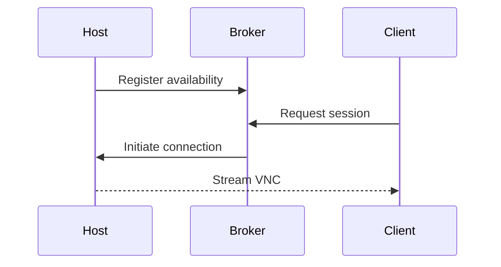

# ds-vnc-codex

Prototype repository for building a macOS remote access tool.

Swift components require Swift 6.1 or later.

## Architecture

The system consists of:

- **Host agent** running on macOS machines to expose remote sessions.
- **Broker** coordinating connections between hosts and clients.
- **Client** connecting through the broker to view or control hosts.

## Setup Flow

1. Prepare the host using the steps in [docs/host_setup.md](docs/host_setup.md).
2. Launch the broker from the `broker` package.
3. Build and run the client as described in [docs/client_usage.md](docs/client_usage.md).

## Security Considerations

- Restrict access to the broker and use authentication where possible.
- Employ network encryption (e.g., TLS) for VNC traffic.
- Limit host permissions and regularly update credentials.

## Scripts

- `scripts/host_setup.sh` – Configures Remote Management and Remote Login on a host Mac using Apple's `kickstart` utility.

> **Note**: The script is designed for macOS and requires administrator privileges.
