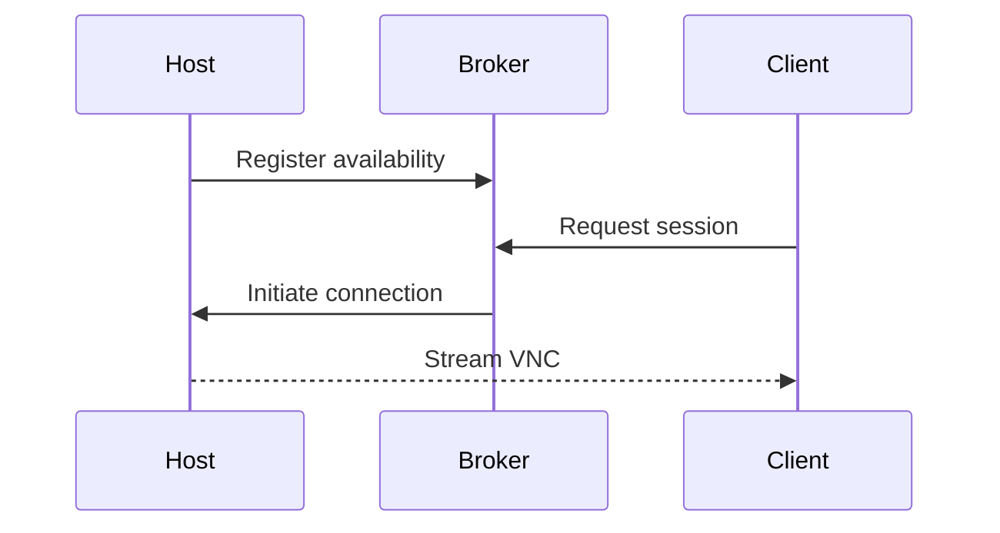

# Client Usage

Instructions for building and using the client to connect through the broker.



## Installation

1. Navigate to the `client` directory.
2. Build the Swift 6.1 package:
   ```bash
   swift build
   ```
3. Run the client, supplying the broker URL if necessary.

## Permissions

- The client requires network access to reach the broker.
- Screen recording permissions may be needed to capture or display remote sessions.

## Troubleshooting

- Ensure the broker is running and reachable.
- Confirm that the host has registered with the broker.
- Run `swift test` in the `client` package if build issues occur.
