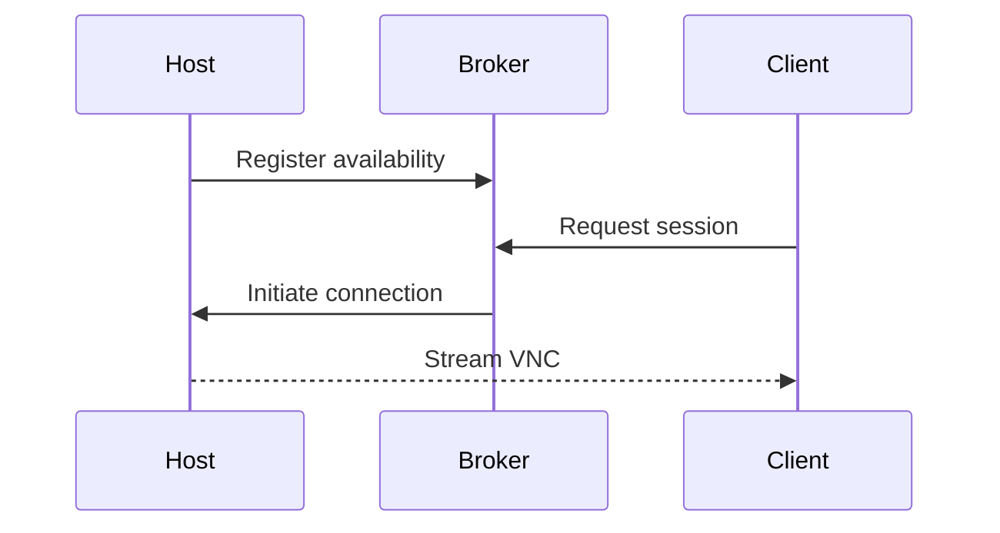

# Host Setup

This guide describes how to prepare a macOS host for remote access through the ds-vnc-codex system.



## Installation

1. Ensure you have administrator privileges on the host machine.
2. Run the setup script:
   ```bash
   sudo scripts/host_setup.sh
   ```
3. Build and install the host agent from the `host-agent` directory if required.

## Permissions

- Remote Management and Remote Login require admin rights.
- Grant screen recording and accessibility permissions to the host agent.

## Troubleshooting

- Verify that "Screen Sharing" and "Remote Login" are enabled in System Preferences.
- Check `/var/log/system.log` for errors related to remote services.
- Ensure the broker URL is reachable from the host.
